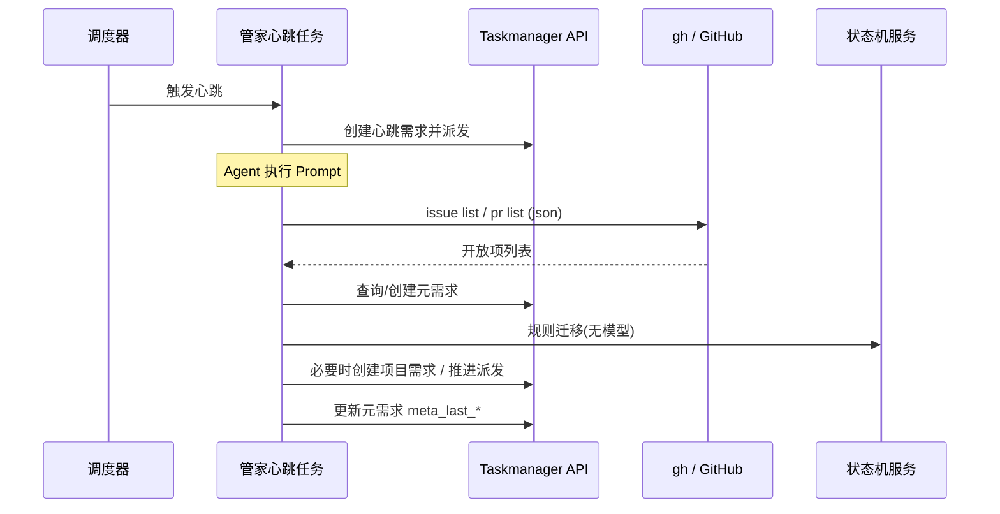
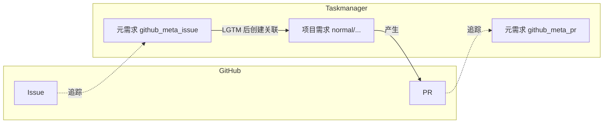
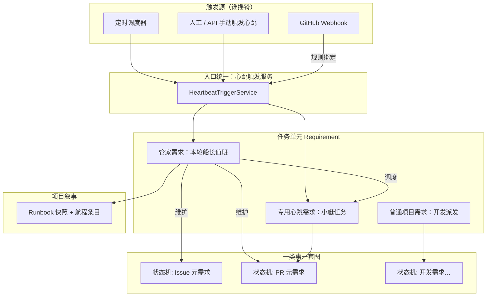
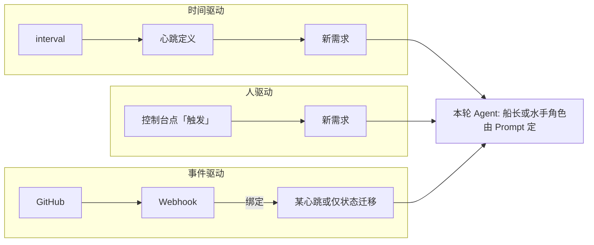

# AI 自主驱动的任务闭环 — 详细设计

> 本文档描述「单一管家心跳 + 元需求 + 少量专用心跳 + 确定性/显式状态迁移」的完整设计，可与 `backend/domain/statemachine`、心跳触发链路对照实现。

---

## 目录

1. [目标与边界](#1-目标与边界)
   - [1.4 任务粒度原则（心跳与需求要足够简单）](#14-任务粒度原则心跳与需求要足够简单)
2. [概念与术语](#2-概念与术语)
3. [端到端流程](#3-端到端流程)
4. [架构与组件](#4-架构与组件)
   - [4.1 概念模型：船长、状态机与触发源](#41-概念模型船长状态机与触发源)
     - [关系总图（Mermaid）](#关系总图mermaid)
     - [术语与模块对照](#术语与模块对照)
     - [数据落在何处](#数据落在何处)
5. [GitHub 约定（唯一来源）](#5-github-约定唯一来源)
6. [状态迁移权威模型](#6-状态迁移权威模型)
7. [元需求数据模型](#7-元需求数据模型)
8. [状态机完整配置](#8-状态机完整配置)
9. [管家心跳](#9-管家心跳)
   - [9.0 管家运行上下文（Runbook）](#90-管家运行上下文runbook)
   - [9.0.8 项目航海日记：推荐数据结构](#908-项目航海日记推荐数据结构)
10. [专用心跳](#10-专用心跳)
11. [触发与参数传递](#11-触发与参数传递)
12. [Webhook 设计](#12-webhook-设计)
13. [后端接口与模块](#13-后端接口与模块)
14. [前端与可观测性](#14-前端与可观测性)
15. [错误处理与幂等](#15-错误处理与幂等)
16. [实施阶段与任务拆解](#16-实施阶段与任务拆解)
17. [测试策略](#17-测试策略)
18. [风险](#18-风险)

---

## 1. 目标与边界

### 1.1 目标

| 编号 | 目标 |
|------|------|
| G1 | 以 **GitHub Issue/PR** 为协作面，在系统内可追踪每条 Issue/PR 的**生命周期状态**。 |
| G2 | **单一调度入口（管家心跳）** 周期性整合扫描，避免多路定时心跳重复打 GitHub API。 |
| G3 | **专用心跳** 只做重活（实现、修 PR 等），由管家或状态机 Hook **按需触发**，并支持 **参数**（issue/pr 号）。 |
| G4 | 每一次状态迁移**可审计**：要么来自**服务端规则/Webhook**，要么来自 **Agent 显式调用** 迁移 API。 |
| G5 | 自动化中心可展示 **元需求看板** 与 **心跳执行轨迹**（含多类型心跳需求）。 |
| G6 | **管家心跳**具备跨轮次的 **运行上下文（Runbook）**：知道上一轮做了什么、结果如何、本轮焦点与阶段目标，避免「每次从零推理」。子任务仍保持短小（§1.4），连续性由 Runbook + 元需求状态机 + GitHub 真相共同提供。 |

### 1.2 非目标

- 不引入独立 BPMN/Workflow 引擎。
- 不要求与历史「8 路并行心跳」兼容；专用心跳数量可裁剪。
- 不在本文内规定具体 Agent 模型与工具链版本。

### 1.3 与代码库的硬约束

状态机配置解析与校验见 `backend/domain/statemachine/state_machine.go`：

- 必须包含状态 ID **`todo`** 与 **`completed`**（`completed` 须 `is_final: true`）。
- `todo` 至少有一条出向 `transitions`。
- **同一 `(from_state, trigger)` 组合在实现上取第一条匹配**（`FindTransition`），故 **禁止** 重复定义相同 `from` + `trigger` 指向不同 `to`。

下文 YAML 已全部按上述约束编排。

### 1.4 任务粒度原则（心跳与需求要足够简单）

复杂流程靠 **状态机与管家多次调度** 拼出来，**不靠**「一次心跳里塞满全流程」。类比现实世界里 **1+1=2** 那种清晰、可一眼判对错的粒度：每一次由心跳派生出的 **需求（Requirement）** 都应是 **独立、完整、短小** 的任务单元。

| 原则 | 含义 |
|------|------|
| **一事一任务** | 一次派发只做 **一件** 可验收的事：例如「对 Issue #42 发一条分析评论」「对 PR #7 修掉评审里指出的 A 点」「开一个关联 Issue 的 PR」——不要在同一需求里同时「扫全库 + 分析 + 实现 + 评审」。 |
| **时间有界** | 单次执行应有 **预期上限**（由团队定，例如轻量 5～15 分钟级、实现类 30～90 分钟级）；超时则失败可重试或拆子任务，而不是无限跑。 |
| **可验收** | 结束条件像算术一样明确：「评论已发」「PR 已开」「push 已完成」；避免「尽量做好」式描述。 |
| **复杂是编排的事** | 长链路 = 多个状态 × 多次心跳/多次需求；**禁止**用超长 Prompt 替代编排。 |
| **管家也要轻** | 管家一轮只做：扫一眼 → 处理 **1～2** 个事项 → 其余下轮；不把「整个项目季度规划」塞进一次管家任务。 |

**反例**：一个心跳 Prompt 要求 Agent「列出所有 open issue、逐个深度分析、再选三个写代码、再开 PR」——应拆成 **多次触发** 或 **多个专用心跳各带单 issue/pr 参数**。

**正例**：专用心跳 `github_implement` 仅带 `issue_number=42`，目标只有一个：在本轮可接受时间内完成该 Issue 对应实现并开 PR（若太大则先在 Issue 侧拆分子 Issue，再分别派发）。

**与 Runbook 的关系**：§1.4 要求单次执行「短」，**管家**仍须携带跨轮 **[§9.0 Runbook](#90-管家运行上下文runbook)**——那是编排用的记事本（上轮结论、阶段目标、本轮焦点），与「单轮动作范围小」不矛盾：管家每轮仍只处理 1～2 个事项，但**决策**应基于 Runbook + 元需求状态 + `gh` 现查。

---

## 2. 概念与术语

| 术语 | 说明 |
|------|------|
| **元需求（Meta Requirement）** | 一条 `Requirement`，`requirement_type` 为 `github_meta_issue` 或 `github_meta_pr`，用于绑定某 GitHub Issue/PR 与生命周期状态机。 |
| **项目需求（Work Requirement）** | 系统内可 **dispatch** 给 CodingAgent 的需求，由 Issue 在 label `lgtm` 后创建，承载实际开发；通过外键式字段或描述关联 Issue 元需求。 |
| **管家心跳** | 定时（+ 可选 Webhook 唤醒）执行，负责扫库、维护元需求、规则迁移、触发专用心跳；**每轮派发前注入 Runbook**（见 §9.0）。 |
| **Runbook（管家运行上下文）** | 按项目（或按管家心跳实例）持久化的摘要与指针：上一轮结论、当前焦点、阶段目标；**不是**把整段对话历史塞进 Prompt。 |
| **专用心跳** | 如 `github_implement`、`github_pr_fix`；**不以全库扫描为主路径**，由参数指定目标 Issue/PR。 |
| **确定性迁移** | 不依赖模型语义，由 `gh` JSON、Webhook payload、标签存在性等判定后直接 `TriggerTransition`。 |
| **显式迁移** | Agent 在任务结束时调用 `POST .../state-machines/.../transition` 或 CLI 等价物。 |

---

## 3. 端到端流程

### 3.1 主流程（文字）

1. 用户在 GitHub 创建 Issue。
2. 管家扫描 → 若无元需求则 **创建 `github_meta_issue`**，状态机从 `todo` 进入后续阶段（可由 AI 或人工在 GitHub 协作）。
3. Issue 经讨论后打上 **label `lgtm`** → **服务端规则**（或管家内规则）将元需求迁移到「可同步项目需求」状态 → 创建 **项目需求** 并关联 `meta_object_id`。
4. 管家或人工触发 **项目需求派发**，进入实现阶段。  
   `github_implement` / `github_pr_fix` 等专用心跳属于 **P1 增强能力**，不作为 P0 主链路依赖。
5. Agent 创建 PR（`Closes #n`）→ Webhook / 规则将 Issue 元需求迁到「已关联 PR」，PR 侧 **创建 `github_meta_pr`** 或使用已有追踪。
6. PR 走评审、修复、合并闸门；合并事件 → **确定性** 将 PR 元需求、`github_meta_issue` 置为 `completed`。

### 3.2 时序图（管家一轮）



### 3.3 对象关系（示意）



---

## 4. 架构与组件

```
┌─────────────────────────────────────────────────────────────┐
│                     管家心跳 github_project_manager          │
│   输入: 项目配置、gh 认证、上一轮 meta_last_*               │
│   输出: 元需求 CRUD、规则迁移、TriggerHeartbeatWithParams    │
└────────────────────────────┬────────────────────────────────┘
                             │
     ┌───────────────────────┼───────────────────────┐
     ▼                       ▼                       ▼
┌─────────┐           ┌───────────┐           ┌───────────────┐
│ GitHub  │           │ 状态机 SM  │           │ 专用心跳       │
│ gh CLI  │           │ Issue/PR  │           │ implement/fix │
└─────────┘           └───────────┘           └───────────────┘
                             │
                             ▼
                    ┌─────────────────┐
                    │ Webhook ingress   │
                    │ PR merge / sync    │
                    └─────────────────┘
```

### 4.1 概念模型：船长、状态机与触发源

本节把前文术语 **收束成一套可对外讲解的比喻**，与实现一一对应。

#### 船长（项目管家）

| 比喻 | 实现 |
|------|------|
| **船长** | **项目管家**（管家类心跳所派发的职责）：有 **航海日记**（Runbook 快照 + 航程条目 §9.0.8）、有 **阶段目标**（`phase_goal`）、知道 **现在走到哪**（快照 + 元需求状态机 + `gh` 现查）。 |
| **船长不亲自扛所有缆绳** | 船长负责 **调度、下发指令、按情况派发任务**；重活由 **专用心跳/项目需求** 执行（水手/小艇）。 |
| **船长的分身 / 大副执行本轮值班** | 每一轮 **管家心跳生成的那条需求** 由 Agent 执行：Agent 以 **船长职权**（Prompt + Runbook + 工具）代行判断——相当于 **船长助理代班**，但叙事上仍是「本轮船长决策」。 |
| **定时响铃** | **定时心跳** = 闹钟/助理提醒「该巡船了」→ 触发一次 **管家需求** → 由「船长视角」的 Agent 决定本轮具体做什么（仍受 §1.4 单轮范围约束）。 |

#### 状态机：一类事的「套路 / 航路图」

| 比喻 | 实现 |
|------|------|
| **一套套航路图** | **一类对象或一类需求类型绑定一套状态机**（如 Issue 元需求一条线、PR 元需求一条线、普通开发需求一条线）。 |
| **每票货按自己的图走** | 每个 **任务（Requirement）** 在创建时初始化对应状态机实例；执行过程按 **AIGuide + 显式/确定性迁移** 推进（§6）。 |
| **船长不背下整张海图的所有细节** | 船长 **调度**「哪条任务、是否触发子心跳」；**单条任务** 的细节推进由 **该任务的状态机** 约束。 |

#### 心跳、Webhook 与「谁决定出发」

| 触发方式 | 谁决定「何时动」 | 典型行为 |
|----------|------------------|----------|
| **船长主动** | **人 / 策略 / 管理台** 手动触发某心跳，或管家在轮值内 **TriggerHeartbeatWithParams** 创建子任务 | 灵活，用于补位与插队。 |
| **定时心跳** | **时钟固定**；时刻不由船长改（改的是 `interval` 配置） | 到点生成需求 → 往往对应 **管家一轮** 或某专用心跳；像 **助理定时请船长出来巡视**。 |
| **Webhook** | **外部系统（GitHub）固定**；事件类型与仓库配置绑定 | **规则化**：到达即迁移状态或触发绑定心跳；**不是**船长「想什么时候就什么时候」。 |

**小结**：**心跳**（定时或手动）与 **Webhook** 都是「产生需求 / 推进状态」的入口；**管家**是 **编排大脑**，其值班可由 **定时心跳** 规律唤醒，也可由 **Webhook** 与 **人工** 插单；**每条需求** 仍挂在各自 **状态机** 上执行。

#### 与 §1.4「小任务」的关系

- **船长一轮**、**专用心跳一条**：仍应是 **短、可验收** 的任务单元。  
- **复杂** 来自 **多轮值班 + 多条需求 + 多条状态机实例**，而非单条 Prompt 无限膨胀。

#### 关系总图（Mermaid）

**触发 → 需求 → 状态机 → 外部世界**



**定时 vs 外部 vs 人的一条简图**



#### 术语与模块对照

| 口头说法 | 代码/数据中的落点 |
|----------|-------------------|
| 船长 | 管家类心跳配置 + 其派发的 **Requirement**（+ Prompt 中的职权描述） |
| 航海日记 | `project_runbook_snapshots` + `project_voyage_entries`（§9.0.8） |
| 航路图 / 一类事的套路 | `state_machines` 配置 + `project_state_machines` 绑定到 `requirement_type` |
| 这一票货走到哪 | `requirement_states` + `transition_logs` |
| 定时摇铃 | `HeartbeatScheduler` + `heartbeats.interval_minutes` |
| 助理代船长值班 | 执行管家需求的那次 **Agent 会话**（同一条 Requirement 的 `trace_id` / 对话） |
| 小艇出海 | `TriggerHeartbeatWithParams` 触发的专用心跳需求 |
| 外港发报 | `webhook_event_logs` + 处理逻辑里调用状态机或 `TriggerWithSource` |

#### 数据落在何处

| 想回答的问题 | 优先查 |
|--------------|--------|
| 项目整体走到哪一「阶段叙事」 | Runbook 快照 + 航程条目 |
| 某个 Issue/PR 在系统里什么状态 | 对应元需求 + `requirement_states` |
| 某次心跳为何失败 | 该需求的 `last_error` / `agent_runtime_result` |
| GitHub 上实际怎样 | `gh` 或 Webhook 落库 payload |
| 谁何时触发了哪次心跳 | 需求标题里 `[心跳][scheduler|manual|webhook]` + `acceptance_criteria` 内 `heartbeat_id` |

---

**专用心跳（推荐起步 2～3 个，可增删）**

| 逻辑名 | requirement_type 建议 | 职责 |
|--------|------------------------|------|
| GitHub 实现 | `github_implement` | 指定 Issue：clone、开发、`gh pr create` |
| GitHub PR 修复 | `github_pr_fix` | 指定 PR：checkout 分支、按评论修改、push |
| GitHub 轻量评审（可选） | `github_pr_review_light` | 指定 PR：发「需求评审通过」前序评论等 |

---

## 5. GitHub 约定（唯一来源）

实现代码、管家 Prompt、专用心跳 Prompt **仅允许引用下表**。

| 语义 | 机器可判定形式 | 人类/Agent 操作示例 |
|------|----------------|----------------------|
| Issue 可进入「同步项目需求 / 派发开发」 | Issue 含 **label `lgtm`**（小写） | `gh issue edit N --add-label lgtm` |
| PR 需求维度评审完成 | 任意评论正文包含 **`需求评审通过`** | `gh pr comment` |
| 合并前批准类评论 | 评论正文包含 **`/lgtm`**（与 label 区分） | 与内置场景、`gh pr comment` 一致 |
| PR 与 Issue 关联 | PR body 含 `Closes #N` 或 `Fixes #N` | `gh pr create` 模板 |

**禁止**：在文档或 Prompt 中写「给 Issue 打 /lgtm 标签」——`/lgtm` 在本约定中为 **PR 评论**，Issue 侧用 **label `lgtm`**。

---

## 6. 状态迁移权威模型

### 6.1 分类

| 类别 | 触发方 | 典型 trigger 名（示例） | 说明 |
|------|--------|-------------------------|------|
| A. Webhook | `GitHubWebhookHandler` 后处理 | `pr_merged`, `pr_synchronize` | Payload 解析后调用 SM |
| B. 管家规则 | 管家执行线程内，**无 LLM** | `lgtm_label_applied` | 对 `gh issue view --json labels` 判定 |
| C. Agent 显式 | 任务结束脚本/模型调用 API | `requirement_approved`, `dispatch_started` | 必须落库，禁止仅对话声明 |
| D. 人工 | 管理台 / CLI | `unblock_to_refining` | 可选 |

### 6.2 SuccessCriteria / AIGuide 的定位

- **指导 Agent**：说明本状态要做什么。
- **不**作为自动迁移引擎；迁移须经过 §6.1 的 A/B/C/D。

---

## 7. 元需求数据模型

### 7.1 需求类型管理（动态化）

**原则**：需求类型**不**在代码中硬编码枚举，全部通过 `requirement_types` 数据库表管理（详见 [§C.2](#c2-需求类型管理完全动态化通过requirement_types表驱动) 与 [§C.3](#c3-requirement_types表的扩展与初始化)）。

| `code` | `name` | 用途 | 绑定状态机 |
|--------|--------|------|-----------|
| `github_meta_issue` | Issue 元需求 | 追踪 Issue | `github_issue_lifecycle` |
| `github_meta_pr` | PR 元需求 | 追踪 PR | `github_pr_lifecycle` |
| `github_meta_manager` | 管家心跳 | 管家调度 | 可选（轻量或无） |

创建元需求或触发管家心跳时，系统按 `code` 查询 `requirement_types` 表，自动获取对应的 `state_machine_id` 并初始化状态机实例。

> 说明：`requirement_types` 继续保持**动态化**；P0 只依赖以上三类 GitHub 相关类型。`github_implement` / `github_pr_fix` 若后续启用，可在 P1 通过数据库继续注册，无需改代码枚举。

### 7.2 表结构扩展（推荐）

在 `requirements` 表增加：

| 列名 | 类型 | 说明 |
|------|------|------|
| `meta_object_type` | TEXT | `issue` \| `pr` |
| `meta_object_id` | INTEGER | GitHub 序号 |
| `meta_object_url` | TEXT | 完整 URL |
| `meta_last_scanned_at` | INTEGER | Unix 时间戳，管家扫到即更新 |
| `meta_last_action_at` | INTEGER | 上次业务动作（创建 WR、触发子心跳等） |
| `meta_last_action_type` | TEXT | 短枚举：`scan` / `create_wr` / `trigger_child` / `rule_transition` |

**索引**：`(project_id, meta_object_type, meta_object_id)` 唯一，防止重复元需求。

### 7.3 项目需求与元需求关联

`requirements` 中项目需求（可派发）增加可选列：

| 列名 | 说明 |
|------|------|
| `source_meta_requirement_id` | 来自哪条 Issue 元需求（TEXT UUID） |

便于从 Issue 元需求跳到开发需求与 PR。

### 7.4 AcceptanceCriteria 扩展块（可选）

若暂不扩表，可在 `AcceptanceCriteria` 内嵌 JSON：

```json
{
  "github_meta": {
    "object_type": "issue",
    "object_id": 42,
    "object_url": "https://github.com/org/repo/issues/42"
  }
}
```

**不推荐长期依赖**：查询与唯一约束较弱，建议落列。

---

## 8. 状态机完整配置

以下 YAML 与 `statemachine.Config` 字段一致（`states` / `transitions`）。**状态 ID 含强制项 `todo`、`completed`**。

### 8.1 `github_issue_lifecycle`（Issue 元需求）

**说明**：`todo` 表示「新 Issue 已纳入追踪尚未深度处理」；业务上也可称「待分析」。`completed` 表示 Issue 侧生命周期结束（通常 PR 已合并）。

```yaml
name: github_issue_lifecycle
description: GitHub Issue 元需求生命周期（与 taskmanager 校验器兼容）
initial_state: todo

states:
  - id: todo
    name: 新 Issue / 待分析
    is_final: false
    ai_guide: |
      阅读 Issue，必要时在 GitHub Issue 评论中提问；不要修改业务代码。
      使用：gh issue view <n> --json title,body,labels,comments
    success_criteria: |
      已有一次有意义的互动（评论或标签变更）或已记录「无需操作」
    triggers:
      - trigger: start_analysis
        description: 开始分析/完善需求
      - trigger: mark_blocked
        description: 标记阻塞

  - id: refining
    name: 需求完善中
    is_final: false
    ai_guide: |
      结合仓库上下文分析可行性；在 Issue 下发表分析；可建议添加 label。
    triggers:
      - trigger: need_more_info
        description: 需要作者补充信息
      - trigger: ready_for_lgtm
        description: 需求已清晰，等待打 lgtm 标签
      - trigger: mark_blocked
        description: 阻塞

  - id: waiting_info
    name: 等待信息
    is_final: false
    ai_guide: |
      等待 Issue 作者回复；可定期 gh issue view 检查新评论。
    triggers:
      - trigger: info_received
        description: 已收到有效回复
      - trigger: timeout_human
        description: 超时转人工

  - id: waiting_lgtm
    name: 等待 label lgtm
    is_final: false
    ai_guide: |
      等待维护者给 Issue 打上 **label lgtm**（小写）。不要与 PR 评论 /lgtm 混淆。
    triggers:
      - trigger: lgtm_label_applied
        description: 已检测到 lgtm 标签（确定性）
      - trigger: scope_changed
        description: 需求范围变化，退回完善

  - id: sync_project_requirement
    name: 待同步项目需求
    is_final: false
    ai_guide: |
      已具备 lgtm：在系统内创建可派发的项目需求，并填写 source_meta_requirement_id。
    triggers:
      - trigger: project_requirement_created
        description: 项目需求已创建

  - id: waiting_dispatch
    name: 等待派发
    is_final: false
    ai_guide: |
      等待创建出的项目需求被 dispatch；P0 不依赖专用心跳。
    triggers:
      - trigger: dispatch_started
        description: 已派发或已触发实现类心跳

  - id: implementing
    name: 开发中
    is_final: false
    ai_guide: |
      由已派发的项目需求/Agent 在独立 workspace 执行；关注是否已开 PR 并关联 Issue。
    triggers:
      - trigger: pr_opened
        description: 已有关联 PR

  - id: linked_pr
    name: 已关联 PR
    is_final: false
    ai_guide: |
      后续进展以 PR 与 Webhook 为准；可轮询 gh pr list 关联 Issue。
    triggers:
      - trigger: pr_merged
        description: PR 已合并（确定性，推荐 Webhook）

  - id: blocked
    name: 阻塞
    is_final: false
    ai_guide: |
      记录原因；需要人工或解除条件后再迁移。
    triggers:
      - trigger: unblock_to_refining
        description: 回到完善
      - trigger: unblock_to_lgtm
        description: 回到等待 lgtm

  - id: completed
    name: 已完成
    is_final: true

transitions:
  - { from: todo, to: refining, trigger: start_analysis }
  - { from: todo, to: blocked, trigger: mark_blocked }

  - { from: refining, to: waiting_info, trigger: need_more_info }
  - { from: refining, to: waiting_lgtm, trigger: ready_for_lgtm }
  - { from: refining, to: blocked, trigger: mark_blocked }

  - { from: waiting_info, to: refining, trigger: info_received }
  - { from: waiting_info, to: blocked, trigger: timeout_human }

  - { from: waiting_lgtm, to: sync_project_requirement, trigger: lgtm_label_applied }
  - { from: waiting_lgtm, to: refining, trigger: scope_changed }

  - { from: sync_project_requirement, to: waiting_dispatch, trigger: project_requirement_created }

  - { from: waiting_dispatch, to: implementing, trigger: dispatch_started }

  - { from: implementing, to: linked_pr, trigger: pr_opened }

  - { from: linked_pr, to: completed, trigger: pr_merged }

  - { from: blocked, to: refining, trigger: unblock_to_refining }
  - { from: blocked, to: waiting_lgtm, trigger: unblock_to_lgtm }
```

**实现建议（P0）**：`lgtm_label_applied` 之后先进入 `sync_project_requirement`，由服务端创建项目需求并推进到 `waiting_dispatch`。专用心跳自动开工策略放到 P1 再评估。

### 8.2 `github_pr_lifecycle`（PR 元需求）

**说明**：从 `todo`（新 PR）到 `completed`；`closed` 用于关闭未合并。**每个 `(from, trigger)` 全局唯一。**

```yaml
name: github_pr_lifecycle
description: GitHub PR 元需求生命周期
initial_state: todo

states:
  - id: todo
    name: 新 PR
    is_final: false
    ai_guide: |
      gh pr view；判断是否需要需求评审。
    triggers:
      - trigger: begin_requirement_review
        description: 进入需求评审

  - id: requirement_reviewing
    name: 需求评审中
    is_final: false
    ai_guide: |
      关联 Issue；评论中写入结论；若通过须包含「需求评审通过」。
    triggers:
      - trigger: requirement_approved
        description: 需求评审通过（含关键字）
      - trigger: requirement_revision_requested
        description: 需求不清，需大改

  - id: code_reviewing
    name: 代码评审中
    is_final: false
    ai_guide: |
      gh pr diff；行评或总评；指出必须修改点。
    triggers:
      - trigger: code_review_requests_changes
        description: 代码需改
      - trigger: code_review_approved
        description: 代码评审通过，进入合并前检查

  - id: waiting_changes
    name: 等待作者修改
    is_final: false
    ai_guide: |
      等待新 commit；P0 以作者或人工修复为主，`github_pr_fix` 属于 P1 增强能力。
    triggers:
      - trigger: changes_pushed
        description: 有新 push
      - trigger: assign_fix
        description: 指派专用心跳修复
      - trigger: give_up
        description: 放弃并关闭（少见）

  - id: fixing
    name: 修复中（可由专用心跳执行）
    is_final: false
    ai_guide: |
      在 PR 分支上修改并 push。
    triggers:
      - trigger: fix_pushed
        description: 修复已推送，回到代码评审

  - id: checking_merge_ready
    name: 合并前检查
    is_final: false
    ai_guide: |
      gh pr checks；无未解决评论；必要时发 /lgtm 评论（见 §5）。
    triggers:
      - trigger: merge_ready
        description: 检查通过
      - trigger: merge_blocked
        description: 仍有问题，退回等待修改

  - id: adding_doc
    name: 补充文档（可选阶段）
    is_final: false
    ai_guide: |
      按需补 README/changelog。
    triggers:
      - trigger: doc_done
        description: 文档处理完

  - id: adding_test
    name: 补充测试（可选阶段）
    is_final: false
    ai_guide: |
      按需补测试并跑通。
    triggers:
      - trigger: test_done
        description: 测试处理完

  - id: waiting_merge
    name: 等待合并
    is_final: false
    ai_guide: |
      由维护者合并；或策略允许 bot merge（默认关闭）。
    triggers:
      - trigger: merged
        description: 已合并

  - id: completed
    name: 已完成
    is_final: true

  - id: closed
    name: 已关闭（未合并）
    is_final: true

transitions:
  - { from: todo, to: requirement_reviewing, trigger: begin_requirement_review }

  - { from: requirement_reviewing, to: code_reviewing, trigger: requirement_approved }
  - { from: requirement_reviewing, to: waiting_changes, trigger: requirement_revision_requested }

  - { from: code_reviewing, to: waiting_changes, trigger: code_review_requests_changes }
  - { from: code_reviewing, to: checking_merge_ready, trigger: code_review_approved }

  - { from: waiting_changes, to: fixing, trigger: assign_fix }
  - { from: waiting_changes, to: code_reviewing, trigger: changes_pushed }
  - { from: waiting_changes, to: closed, trigger: give_up }

  - { from: fixing, to: code_reviewing, trigger: fix_pushed }

  - { from: checking_merge_ready, to: adding_doc, trigger: merge_ready }
  - { from: checking_merge_ready, to: waiting_changes, trigger: merge_blocked }

  - { from: adding_doc, to: adding_test, trigger: doc_done }

  - { from: adding_test, to: waiting_merge, trigger: test_done }

  - { from: waiting_merge, to: completed, trigger: merged }

  - { from: todo, to: closed, trigger: pr_closed }
  - { from: requirement_reviewing, to: closed, trigger: pr_closed }
  - { from: code_reviewing, to: closed, trigger: pr_closed }
  - { from: waiting_changes, to: closed, trigger: pr_closed }
  - { from: fixing, to: closed, trigger: pr_closed }
  - { from: checking_merge_ready, to: closed, trigger: pr_closed }
  - { from: adding_doc, to: closed, trigger: pr_closed }
  - { from: adding_test, to: closed, trigger: pr_closed }
  - { from: waiting_merge, to: closed, trigger: pr_closed }
```

**可选简化**：若团队不需要独立「文档/测试」阶段，可将 `checking_merge_ready` 直接 `merge_ready` → `waiting_merge`，删除 `adding_doc` / `adding_test` 两状态。

---

## 9. 管家心跳

单轮工作量与「一次只做少量事」的约束见 **[§1.4 任务粒度原则](#14-任务粒度原则心跳与需求要足够简单)**。跨轮 **记忆与目标** 由本节 **§9.0 Runbook** 承担。

### 9.0 管家运行上下文（Runbook）

#### 9.0.0 隐喻：航海日记（仅管家使用）

可以把 **Runbook** 理解成 **船长手里的航海日记**——**不是**某一次「放小艇干活」的任务单，而是 **整条船在时间长轴上** 的记录与计划：

| 角色 | 对应 | 日记里记什么 |
|------|------|----------------|
| **船长** | **管家心跳**（编排与决策） | 我们**要去哪**（阶段目标 `phase_goal`）、**现在在朝哪个方向走**（`current_focus`）、**上一段航程发生了什么**（`last_run_summary` / outcome） |
| **海图与灯塔** | GitHub（`gh`）、元需求状态机 | 客观事实：港口在哪、灯是否亮——**不以日记替代海图** |
| **单次放艇** | 专用心跳派生的小需求 | 只解决**这一趟**的具体活；**不**承担「整条航线叙事」 |

因此 Runbook 应是 **相对独立、专门服务于管家** 的一层数据：  
**独立**于每一条瞬时派发的 `Requirement`（那些像「单次航海任务报告」）；**独立**于 Issue/PR 元需求上的状态机（那是「每票货物的在途状态」）。没有这本日记，船长每轮上任都像第一次出海——只能现场看海图（`gh`），不知道**本船**上周决定先清哪条航线、进行到哪一步。

实现上仍用 §9.0.3 的字段与 §9.0.4～9.0.5 的注入/回写；本小节只固定 **产品隐喻与边界**，避免与「小任务需求」混淆。

#### 9.0.1 为什么必须加

当前实现路径（见 `HeartbeatTriggerService.TriggerWithSource`）是：**每次触发都新建一条 `Requirement`**，`description` 主要来自 `Heartbeat.RenderPrompt(project)`。因此若不额外注入：

- Agent **看不到**上一轮管家任务写了什么、判定结果如何；
- **「现在的任务」**容易与「GitHub 上已发生的事实」脱节，只能靠当次 `gh` 现查，**没有**项目侧的持续叙事（例如：我们阶段目标是在本迭代清掉带 `blocked` 的元需求）。

**结论**：需要在平台侧为管家维护一份 **持久化、结构化、体积可控** 的上下文，下称 **Runbook**。  
元需求状态机、Webhook、`gh` 提供 **事实**；Runbook 提供 **编排叙事与上轮结论**，三者一起支撑「持续运转」。

#### 9.0.2 与其它信息源的分工

| 信息源 | 提供什么 | 是否每轮现查 |
|--------|----------|--------------|
| `gh issue list` / `gh pr list` | Issue/PR **当前**开放项与标签 | 是（外部真相） |
| 元需求 + `requirement_states` / `transition_logs` | 每条 Issue/PR 在系统内的状态 | 可按需查询 |
| **Runbook** | 管家 **跨轮** 的摘要：上轮做了什么、结果、本轮意图、阶段目标 | 否，**读库注入** |
| 上一轮管家 `Requirement` 全文 | 历史细节 | 可选：只保留 **链接 + 一行摘要**，避免把长 Prompt 再灌一遍 |

#### 9.0.3 Runbook 建议字段（持久化）

存放粒度：**按 `project_id` 一条**；若同一项目有多个「管家类」心跳，可增加 **`heartbeat_id`** 联合主键。

| 字段 | 类型 | 含义 |
|------|------|------|
| `phase_goal` | TEXT | 当前阶段目标（一句话，人工或 Agent 定期更新） |
| `last_run_at` | INTEGER | 上次管家心跳触发时间 |
| `last_run_requirement_id` | TEXT | 上一轮产生的管家需求 ID（便于跳转审计） |
| `last_run_summary` | TEXT | 上轮执行摘要：处理了哪些 Issue/PR、成功/失败、是否已触发子心跳 |
| `last_run_outcome` | TEXT | 枚举建议：`success` / `partial` / `failed` / `noop` |
| `current_focus` | TEXT | 本轮建议焦点（例如：优先 Issue #42、或「无，维持扫尾」） |
| `next_planned` | TEXT(JSON) | 可选：队列下一批编号列表，供 Prompt 直接展示 |
| `rolling_notes` | TEXT | 可选：短滚动笔记（限制长度，例如 ≤2KB），超时由实现截断或摘要 |

**建议落地（P0）**：直接使用独立表 `project_runbook_snapshots`，避免把项目表做成大 JSON 杂糅区，也避免后续再搬迁。

#### 9.0.4 注入点（与现有代码对齐）

在 **`HeartbeatTriggerService`** 内，当 `heartbeat_id` 为管家（或 `requirement_type` 为管家类型）时，在 `RenderPrompt` 之后、`NewRequirement` 之前：

1. 加载 Runbook 记录；
2. 可选：查询「上一轮同心跳需求」的 `agent_runtime_result` 一行摘要（若已实现）；
3. 将下列块 **追加** 到本次需求的 `description`（或独立字段若后续扩展）：

```markdown
==================== 管家运行上下文（Runbook）====================
阶段目标：${runbook.phase_goal}
上次执行：${runbook.last_run_at} → 结果：${runbook.last_run_outcome}
上次摘要：${runbook.last_run_summary}
本轮建议焦点：${runbook.current_focus}
待下轮处理（若有）：${runbook.next_planned}
================================================================
```

变量名以实现为准；**禁止**把完整历史对话贴入。

#### 9.0.5 回写协议（每轮结束必须更新 Runbook）

否则下一轮仍为空。P0 建议只采用 **服务端权威回写**，必要时再开放人工修正：

| 方式 | 做法 |
|------|------|
| **B. 显式 API** | `PUT /api/v1/projects/:id/runbook`，优先供人工修正或系统内部调用 |
| **C. 服务端摘要** | 管家需求进入 `completed` 时，用 `agent_runtime_result` 截断写入 `last_run_summary`，作为默认回写路径 |

P0 推荐 **C 为主、B 为辅**。`A. Agent 结构化收尾` 依赖模型输出格式稳定性，放到后续版本再引入。

#### 9.0.6 与「小任务」原则的关系

- **Runbook** 解决 **连续性**（之前 / 现在 / 目标）；
- **§1.4** 仍约束 **单轮执行动作** 要少、要可验收；
- 子需求（专用心跳）继续是 **独立小任务**；管家是 **调度大脑**，Runbook 是它的 **记事本**，不是把大活塞进一条需求里。

#### 9.0.7 可选：追加审计表

`butler_run_log(id, project_id, heartbeat_id, requirement_id, summary, outcome, created_at)` 仅追加、不删，供排障与回放；Runbook 存「最新快照」，日志存「全历史」。

#### 9.0.8 项目航海日记：P2 增强能力（暂不纳入 P0）

为避免 P0 同时背负“调度闭环”和“复杂项目叙事 UI”两类工作，`ProjectVoyageEntry`、路线图聚合接口、时间线回放等能力统一下沉到 **P2**。  
P0 只要求 **Runbook 快照可读可写**，保证管家具备跨轮连续性。

**原则**：**一个项目一本日记**；日记由两部分组成——**当前页（快照）** 给管家每轮读入 Prompt；**按时间追加的条目** 记录从立项到归档的完整过程，可审计、可回放，不把全历史塞进单次 Prompt。

##### （1）两层模型

| 层 | 作用 | 读写特点 |
|----|------|----------|
| **快照 `ProjectRunbookSnapshot`** | 等价于「船长桌上翻开的那一页」：**现在要去哪、上一段结果、本轮焦点** | **读**：每轮管家触发前加载并注入；**写**：每轮结束或人工/API 更新 |
| **航程条目 `ProjectVoyageEntry`（追加日志）** | 等价于「日记本里从前到后每一篇记录」：里程碑、每一轮管家、阶段变更、重要人工批注 | **只追加**（append-only），原则上不删改；全生命周期 |

二者关系：每轮管家结束时，**先写一条 `ProjectVoyageEntry`**，再 **合并更新 `ProjectRunbookSnapshot`**，保证快照与最后一条条目一致（或快照由最后 N 条条目派生，实现二选一）。

##### （2）表 A：`project_runbook_snapshots`（每项目 0 或 1 行，推荐独立表便于迁移）

| 列名 | 类型 | 说明 |
|------|------|------|
| `project_id` | TEXT PK | 与 `projects.id` 1:1 |
| `updated_at` | INTEGER | 快照最后更新时间 |
| `version` | INTEGER | 乐观锁/迁移用，可选 |
| `phase_goal` | TEXT | 当前阶段目标（可人工改） |
| `current_focus` | TEXT | 本轮/近期焦点 |
| `last_run_at` | INTEGER | 上次管家触发时间 |
| `last_run_requirement_id` | TEXT | 上次管家需求 ID |
| `last_run_outcome` | TEXT | `success` / `partial` / `failed` / `noop` |
| `last_run_summary` | TEXT | 短摘要，供注入 |
| `next_planned` | TEXT | JSON 数组字符串，可选 |
| `rolling_notes` | TEXT | 限长滚动备注，可选 |
| `snapshot_json` | TEXT | **可选**：整快照冗余 JSON，便于扩展字段而不改表 |

项目创建时可 **惰性插入**（第一次管家跑之前）或 **建项目时插入空快照**。

##### （3）表 B：`project_voyage_entries`（P2 再引入）

| 列名 | 类型 | 说明 |
|------|------|------|
| `id` | TEXT PK | ULID/UUID |
| `project_id` | TEXT FK | 索引 |
| `seq` | INTEGER | **项目内单调递增**（由触发器或应用层 `MAX(seq)+1`），保证顺序 |
| `occurred_at` | INTEGER | 事件发生时间 |
| `entry_type` | TEXT | 见下枚举 |
| `title` | TEXT | 一行标题，便于列表展示 |
| `summary` | TEXT | 短摘要（列表用） |
| `detail_json` | TEXT | 可选：结构化详情（关联 issue 号、子心跳 ID、迁移 trigger 等） |
| `heartbeat_id` | TEXT | 可选：哪条管家心跳产生 |
| `requirement_id` | TEXT | 可选：本轮管家需求 ID |
| `actor` | TEXT | `agent` / `system` / `user` / `webhook` |
| `created_at` | INTEGER | 写入时间 |

**`entry_type` 建议枚举**：

| 值 | 含义 |
|----|------|
| `project_started` | 项目创建或首次启用自动化（可选一条「启航」） |
| `phase_changed` | 阶段目标变更（人工或 Agent 更新 `phase_goal`） |
| `heartbeat_round` | 每一轮管家执行结束（**主条目**，与快照一一对应） |
| `child_heartbeat` | 触发了某专用心跳（记参数与结果摘要） |
| `webhook_milestone` | Webhook 驱动的里程碑（如 PR merged）可选记入，便于叙事连续 |
| `manual_note` | 人工在控制台写的批注 |
| `milestone` | 自由里程碑（如「v1 发布」） |

**索引**：`(project_id, seq)`、`(project_id, occurred_at DESC)`。

##### （4）与现有表的关系

- **`requirements`**：仍是「单次任务单」；管家每轮一条；**不**用需求行替代日记。
- **`transition_logs`**：仍是单条需求状态机迁移；**航海日记**是 **项目级** 叙事，二者可互链：`detail_json` 里可写 `requirement_id` / `transition_id`。
- **元需求**：管「每票 Issue/PR」；**航海日记**管「整条船」——层级不同。

##### （5）API 形态（建议，P2）

| 操作 | 说明 |
|------|------|
| `GET /api/v1/projects/:id/runbook` | 返回当前快照（给前端「航海日记」首页卡片 + 给触发器注入） |
| `GET /api/v1/projects/:id/voyage-entries?cursor=&limit=` | 分页读日记条目（时间线 UI） |
| `POST /api/v1/projects/:id/voyage-entries` | 人工补记（`manual_note`） |
| `PUT /api/v1/projects/:id/runbook` | 更新快照（人工改 `phase_goal` 等）；可选同时 `INSERT` 一条 `phase_changed` 条目 |

管家每轮结束：服务端或解析 Agent 输出后 **upsert 快照 + insert voyage entry**。

##### （6）注入 Prompt 时

仍只用 **快照表** 拼 §9.0.4 的 Markdown 块；**不把** `project_voyage_entries` 全表拼进 Prompt。若需「最近脉络」，可 **最多取最近 K 条条目的 title+summary**（如 K=5）附加在快照块下方，并设总字数上限。

---

### 9.1 配置项

| 字段 | 建议值 |
|------|--------|
| 名称 | GitHub 项目管家 |
| 场景内编码 | `github_project_manager` |
| `interval_minutes` | 30（可配置） |
| `requirement_type` | `github_meta_manager` |
| `agent_code` | 项目默认 Agent 或专用「调度型」Agent |

### 9.2 单轮算法（伪代码）

```
1. 加载 project（git URL、dispatch 渠道）
2. gh issue list --state open --json number,title,labels,updatedAt
3. gh pr list --state open --json number,title,updatedAt,headRefName
4. 对每条 Issue/PR：
   a. 从 requirement_types 表按 code 查找对应类型与 state_machine_id
   b. upsert 元需求（唯一索引），若元需求首次创建则 InitializeRequirementState
   c. 基于 gh JSON 结果 + 元需求当前状态 → 调用 StateMachineService.TriggerTransition
      进行确定性迁移（如：检测到 lgtm label → lgtm_label_applied；检测到评论含关键字 → requirement_approved）
   d. 迁移失败或无需迁移则跳过，记录 meta_last_scanned_at
5. 从「待处理集合」按优先级选 1～2 条：
   priority: blocked > 超时 > 24h 内有活动 > FIFO
6. 对选中项：
   a. 若处于 `sync_project_requirement` → 创建项目需求并关联 `source_meta_requirement_id`
   b. 若处于 `waiting_dispatch` → 派发已创建的项目需求
   c. 否则在 Prompt 指导下发评论 / 仅记录系统内执行摘要
7. 更新 meta_last_action_*，回写 Runbook 快照
```

### 9.3 Prompt 骨架（节选）

```markdown
你是 GitHub 项目管家。必须遵守约定：Issue 可开发条件 = **label lgtm**；PR 需求通过 = 评论含 **需求评审通过**；批准类评论用 **/lgtm**。

项目：${project.name}
仓库：${project.git_repo_url}

本回合步骤：
1. 执行 gh issue list / gh pr list（JSON），不得超过 50 条/类。
2. 对缺少元需求的 open 项：说明将调用 API 创建元需求（若你已接入 taskmanager CLI 则执行创建命令）。
3. 对已存在元需求：读取当前状态机状态（从 taskmanager 查询），不要臆造。
4. 仅对 1～2 个最高优先级事项采取行动；其余写入「下回合计划」到系统内执行摘要。
5. 禁止：merge PR、关闭 Issue，除非配置显式开启。
6. P0 不依赖专用心跳；如识别出后续适合参数化专用执行，记录到执行摘要，待 P1 接入。

执行摘要请写在任务汇报中，GitHub 侧仅发必要评论。
```

---

## 10. 专用心跳

每个专用心跳对应的需求仍须满足 **[§1.4](#14-任务粒度原则心跳与需求要足够简单)**：目标单一、可验收、时间有界；若 Issue 过大，先在 GitHub 拆 Issue 再分别派发。

> **阶段说明**：本节能力统一放在 **P1**，不阻塞 P0 主闭环。

### 10.1 `github_implement`（示例）

**参数**：`issue_number`（必填），`base_branch`（可选）

**Prompt 要点**：`gh repo clone` / 现有 workspace 策略、`gh pr create`、PR body 含 `Closes #n`、跑测试与 lint。

**结束**：Agent 显式调用迁移 `pr_opened`（若已开 PR）或回报失败原因。

### 10.2 `github_pr_fix`

**参数**：`pr_number`

**Prompt 要点**：`gh pr checkout`、按 review 评论修改、push、在 PR 下简短回复。

### 10.3 定时策略

- 默认 **`interval_minutes` 极大（如 24h）或禁用调度**，仅 `manual` / `trigger_heartbeat` / Webhook 唤醒。

---

## 11. 触发与参数传递

### 11.1 `TriggerHeartbeatWithParams`（P1）

```go
// 语义示意
func (s *HeartbeatTriggerService) TriggerWithSourceAndParams(
    ctx context.Context,
    heartbeatID string,
    source HeartbeatTriggerSource,
    params map[string]interface{}, // issue_number, pr_number, ...
) (*domain.Requirement, error)
```

**持久化建议**：优先新增独立列 `heartbeat_params_json`；若必须兼容过渡，再考虑临时写入 `AcceptanceCriteria` 前缀块。

### 11.2 状态机 Hook（`transition_executor`）

`Config` 键名：**`heartbeat_id`**（见 `executeTriggerHeartbeat`）。

可选扩展（需实现）：`heartbeat_params` map 合并进 Hook 上下文并写入触发链路。此能力同样放在 P1。

---

## 12. Webhook 设计

### 12.1 订阅事件（建议）

| GitHub 事件 | 用途 |
|-------------|------|
| `pull_request` closed + merged=true | `merged` 迁移 PR 元需求；联动 Issue 元需求 `pr_merged` |
| `issues` labeled | 检测 `lgtm` → `lgtm_label_applied` |

> P1 只实现以上两个高价值事件。`pull_request synchronize`、`issue_comment`、`pull_request_review` 等事件先不纳入主路径，避免过早放大事件风暴与去抖复杂度。

### 12.2 处理管线

1. 验签、解析 `repo`、PR/Issue 号。
2. 查找 `meta_object_id` 对应元需求（按项目 ID + 类型 + 序号）。
3. 调用 `StateMachineService.TriggerTransition` 使用 **§8 中精确 trigger 名**。
4. 失败重试策略：写 `webhook_event_logs`，支持人工重放。

---

## 13. 后端接口与模块

### 13.1 新增/扩展服务

| 模块 | 职责 |
|------|------|
| `MetaRequirementService` | `EnsureMetaForIssue`（按 `requirement_types.code` 查类型+状态机）、`EnsureMetaForPR`、`GetByObject`、`ListByProject` |
| `RequirementTypeService` | 按 `code` 读取类型信息 + 绑定状态机；项目初始化时自动注册内置类型（见 §C.3） |
| `HeartbeatTriggerService` | P0 负责 Runbook 注入（§9.0.4）与运行记录查询修正（见 §14.3）；`TriggerWithSourceAndParams` 放到 P1 |
| `RunbookService` | P0 仅负责 Runbook 快照 upsert/read；航程条目 append 放到 P2 |

> **注意**：不再新建独立的 `GitHubRuleEngine` 模块；所有规则判定通过状态机迁移管线处理（详见 [§C.1](#c1-规则引擎归属使用状态机管理禁止写死)）。

### 13.2 HTTP（示例）

| 方法 | 路径 | 说明 |
|------|------|------|
| `POST` | `/api/v1/heartbeats/:id/trigger` | body 可带 `params` |
| `GET` | `/api/v1/projects/:pid/meta-requirements` | 元需求列表 |
| `POST` | `/api/v1/projects/:pid/meta-requirements/sync` | 可选：手动全量对齐 GitHub |

（具体路径以 `router.go` 为准。）

### 13.3 航海日记与事件航线接口（P2）

P0 不要求引入聚合读接口；先提供最小可用接口即可：

| 方法 | 路径 | 说明 |
|------|------|------|
| `GET` | `/api/v1/projects/:id/runbook` | 读取当前 Runbook 快照 |
| `PUT` | `/api/v1/projects/:id/runbook` | 更新 Runbook 快照 |

以下聚合接口放到 P2：

为支持「看得到路线、看得到进度、看得到事件线条」，建议新增 **聚合读接口**（避免前端 N 次拼装）：

| 方法 | 路径 | 说明 |
|------|------|------|
| `GET` | `/api/v1/projects/:pid/voyage/overview` | 返回航海总览：快照、核心 KPI、当前阶段进度、风险摘要 |
| `GET` | `/api/v1/projects/:pid/voyage/route` | 返回事件航线图（节点+边+进度），用于前端路线图/线条渲染 |
| `GET` | `/api/v1/projects/:pid/voyage/entries?cursor=&limit=&type=` | 分页读取航海日记条目（支持按类型筛选） |
| `GET` | `/api/v1/projects/:pid/voyage/entries/stream` | SSE 增量流，实时推送新条目/状态变化（可选） |
| `POST` | `/api/v1/projects/:pid/voyage/entries` | 人工补记（`manual_note`） |
| `PUT` | `/api/v1/projects/:pid/runbook` | 更新快照（`phase_goal/current_focus` 等） |

`/voyage/route` 返回建议结构（前端可直接画路线）：

```json
{
  "project_id": "p_123",
  "generated_at": 1760000000,
  "summary": {
    "overall_progress_percent": 68,
    "current_phase": "执行与收敛",
    "active_meta_requirements": 14,
    "blocked_count": 2
  },
  "nodes": [
    {
      "node_id": "phase_refining",
      "node_type": "phase",
      "title": "需求完善",
      "status": "completed",
      "progress_percent": 100,
      "x": 120,
      "y": 80
    },
    {
      "node_id": "issue_42",
      "node_type": "issue",
      "title": "Issue #42",
      "status": "in_progress",
      "progress_percent": 55,
      "meta_requirement_id": "req_meta_42",
      "github_url": "https://github.com/org/repo/issues/42",
      "x": 420,
      "y": 160
    }
  ],
  "edges": [
    {
      "edge_id": "e_1",
      "from": "phase_refining",
      "to": "issue_42",
      "edge_type": "state_transition",
      "trigger": "project_requirement_created",
      "occurred_at": 1760000100,
      "is_critical_path": true
    }
  ]
}
```

实现建议：

- 路线图布局优先由后端提供近似坐标（`x/y`），前端只做响应式缩放与微调，减少首屏抖动。
- 以 `transition_logs + requirements(meta_*) + project_voyage_entries` 聚合构图；必要时增加 `voyage_route_snapshots` 做缓存。
- 对于超大项目（>500 节点）采用分层加载：先阶段骨架，再按视口/筛选条件拉取 Issue/PR 子图。

---

## 14. 前端与可观测性

### 14.1 自动化中心 Tab

P0 目标是“先看得见闭环状态”，不是一次到位做完整可视化系统。

| Tab | 内容 |
|-----|------|
| 总览 | 保留；增加「元需求数量、阻塞数」卡片 |
| 元需求看板 | 表：类型、#号、标题、状态机状态、最后扫描、GitHub 链接 |
| 心跳实例 | 列表展示管家 + 专用心跳 |
| Webhook / 状态机 | 现有 |

### 14.2 元需求详情页

- 状态迁移时间线（读 transition log）
- 关联项目需求、PR 链接
- 关联心跳 Run（按 `heartbeat_id` / 标题 `[心跳]` 查询）

### 14.3 运行记录修复要点

- **不得**仅用 `requirement_type == heartbeat` 过滤。
- 条件：`title LIKE '[心跳]%'` **或** `acceptance_criteria LIKE '%heartbeat_id: <id>%'` **或** 显式 `origin_heartbeat` 字段（若后续添加）。

### 14.4 设计目标与视觉语言（P2）

目标不是“多图表”，而是让用户在 10 秒内回答三件事：**我们在哪、走过哪、下一步去哪**。

| 设计目标 | 界面表达 |
|----------|----------|
| 看得到路线 | 主视觉使用「航线图（节点+连线）」展示阶段与 Issue/PR 流转路径 |
| 看得到进度 | 顶部总进度 + 阶段进度条 + 关键路径高亮 |
| 看得到事件 | 右侧事件时间线（航海日记）实时追加，支持筛选与回放 |
| 看得懂风险 | 阻塞事件使用高对比色与醒目标识，提供一键定位到对应节点 |

视觉基调建议：

- 整体采用「深海蓝 + 青绿强调 + 琥珀告警」三阶色板，背景低对比渐变，强调专业与稳定。
- 路线线条采用双层描边（底层弱光 + 顶层实线），关键路径加轻微流动动画，形成“正在航行”的直觉反馈。
- 信息密度控制：主区只放“路线+进度”；次级信息（详情、日志、参数）进入抽屉，避免首屏噪音。
- 时间统一：全局使用相对时间 + 精确时间 Tooltip，保证审计与可读性并存。

### 14.5 页面信息架构（Automation Center 内）

建议将「航海日记」提升为项目级一级页签，与总览并列：

| 页面 | 目的 | 关键组件 |
|------|------|----------|
| 总览（Overview） | 快速健康检查 | KPI 卡片、阶段进度、风险摘要、最近 5 条航海条目 |
| 航海日记（Voyage Journal） | 连续叙事与回放 | 日记时间线、阶段里程碑、人工批注 |
| 事件航线（Event Route） | 路径与依赖分析 | 节点连线图、关键路径、高亮回放、筛选器 |
| 元需求看板 | 任务对象管理 | Issue/PR 元需求表、状态过滤、批量操作 |
| 心跳实例 | 执行追踪 | 心跳运行列表、耗时、失败原因、重试 |

### 14.6 关键页面交互设计

#### A. 航海日记（Voyage Journal）

- 顶部「今日航况」卡：`phase_goal`、`current_focus`、`last_run_outcome`、`overall_progress_percent`。
- 中部纵向时间线：按 `entry_type` 分组（`heartbeat_round`、`child_heartbeat`、`webhook_milestone`、`manual_note`）。
- 条目卡片三段式：标题（发生了什么）/ 摘要（为什么）/ 证据链接（`requirement_id`、GitHub URL、状态迁移）。
- 支持“回放模式”：选择时间区间后自动高亮该区间涉及的路线节点与边。

#### B. 事件航线（Event Route）

- 主画布展示「阶段节点 + Issue/PR 节点 + 连线触发」。
- 左上角提供视图切换：`全局航线` / `仅关键路径` / `仅阻塞链路`。
- 节点视觉编码：形状区分对象类型（阶段/Issue/PR/心跳），颜色区分状态（进行中/完成/阻塞）。
- 点击任一节点，右侧抽屉展示：当前状态、最近迁移、关联条目、可执行动作（触发心跳/打开 GitHub）。

#### C. 进度可视化

- 全局进度采用「环形总进度 + 阶段分段条」组合，避免单一百分比失真。
- 进度计算透明化：在 Tooltip 中显示分子分母（如 `已完成元需求 34 / 50`、`阻塞 2`）。
- 对“卡住但高优先级”的链路增加 `ETA risk` 标记，提示需要人工介入。

### 14.7 前端实现建议（React）

组件分层建议：

| 层级 | 组件建议 | 职责 |
|------|----------|------|
| Page | `VoyageJournalPage`、`EventRoutePage` | 路由级容器，处理筛选参数与布局 |
| Domain Components | `RouteCanvas`、`ProgressRibbon`、`VoyageTimeline`、`NodeDetailDrawer` | 业务可视化核心 |
| State | `useVoyageOverview`、`useVoyageRoute`、`useVoyageEntries` | 统一请求/缓存/重试 |
| Infra | `sseClient`、`timeFormatter`、`routeLayoutAdapter` | SSE、时间格式、坐标适配 |

渲染与性能：

- 路线图建议基于 SVG + Canvas 混合：线条/动画走 Canvas，节点与交互层走 SVG/HTML，提高可交互性。
- 时间线列表使用虚拟滚动（已有日志页经验可复用），保证长历史下仍流畅。
- 采用「静态快照 + 增量事件」模型：首屏拉 `overview + route + 首屏 entries`，随后通过 SSE 增量更新。

### 14.8 后端到前端的数据契约（必须稳定）

前端可视化高度依赖统一语义，后端需固定以下字段语义：

- `status`: `todo|in_progress|blocked|completed|closed`，避免同义词导致颜色映射混乱。
- `progress_percent`: `0~100`，由后端计算，前端只展示不二次推断。
- `entry_type`: 与 §9.0.8 枚举一致，新增类型必须向后兼容。
- `is_critical_path`: 用于关键路径高亮，避免前端自行跑图算法。
- `trace_refs`: 提供跳转锚点（`requirement_id`、`meta_requirement_id`、`transition_id`、`github_url`）。

### 14.9 观测与诊断

- 在航线图页面内置“数据诊断”面板：显示最近一次聚合耗时、节点数、边数、SSE 延迟。
- 对缺失映射（例如条目引用了不存在节点）给出黄条告警，并允许导出诊断 JSON 供排障。
- 提供前端埋点：视图切换、节点点击、筛选使用率，反哺后续交互优化。

---

## 15. 错误处理与幂等

| 场景 | 策略 |
|------|------|
| 重复创建元需求 | DB 唯一索引 `(project_id, meta_object_type, meta_object_id)` 冲突则返回已有 |
| Webhook 重复投递 | 事件 ID 去重（已有 `webhook_event_logs` 可扩展） |
| `gh` 失败 | 管家记录 last_error，下轮重试；指数退避可选 |
| 专用心跳并发同一 PR | 由管家优先级串行或锁（项目+pr 维度） |

---

## 16. 实施阶段与任务拆解

### Phase P0 — 基础可跑（后端闭环最小可用）

- [ ] DB migration：`meta_*` 列与唯一索引
- [ ] `MetaRequirementService` + 基础 API
- [ ] 状态机 YAML：`github_issue_lifecycle`、`github_pr_lifecycle` 入库并绑定相关需求类型
- [ ] 管家心跳 v1：扫描 GitHub、upsert 元需求、做确定性迁移、创建项目需求、推进派发
- [ ] **Runbook 最小快照**：`project_runbook_snapshots`、触发时仅注入快照（§9.0.4）、每轮结束 upsert 快照
- [ ] 运行记录查询修正（§14.3）
- [ ] 前端最小查看能力：元需求列表/详情 + Runbook 快照卡片

### Phase P1 — 自动推进增强

- [ ] Webhook：`pull_request` merged、`issues` labeled
- [ ] `TriggerWithSourceAndParams` + Prompt 变量渲染
- [ ] 专用心跳 `github_implement`、`github_pr_fix` 模板与场景注册
- [ ] PR/Issue 并发与去重控制

### Phase P2 — 体验与观测增强

- [ ] 元需求看板与详情页
- [ ] `project_voyage_entries`
- [ ] 航海日记页（快照卡 + 时间线 + 人工批注）与事件航线页（节点连线 + 关键路径 + 回放模式）
- [ ] 新增 voyage 聚合接口：`overview` / `route` / `entries` / `entries/stream`，并完成前后端联调
- [ ] 进度算法落地（全局进度、阶段进度、阻塞权重）及口径校验
- [ ] 可选：阻塞/耗时统计、告警

---

## 17. 测试策略

| 层级 | 内容 |
|------|------|
| 单元 | 状态机 `Validate()` 必须通过；管家确定性迁移判定与项目需求创建映射 |
| 集成 | P0：元需求唯一约束、Runbook 快照读写、项目需求创建与关联；P1：Webhook payload → 期望 `TriggerTransition` |
| E2E | P0：沙盒仓库建 Issue → label → 创建 WR；P1：模拟 merge → 元需求 `completed` |

---

## 18. 风险

| 风险 | 缓解 |
|------|------|
| GitHub API/限流 | 单管家、分页、冷却；Webhook 优先 |
| 模型绕过状态机 | §6 权威迁移 + 关键路径仅 Webhook/规则 |
| 状态机 YAML 与校验器演进 | 单测锁定 `ParseConfig` + `Validate` |

---

## 附录 A：与 `BuildGitHubDevWorkflowScenario` 的关系

当前内置场景中的多心跳条目可被 **替换或删减**：保留「管家 + 少量专用心跳」即可；`EnsureBuiltInScenarios` 可改为注册新场景 **`github_orchestrated_workflow`**，避免与旧 8 心跳并存重复扫描（若团队仍要旧场景，可在产品层标记为 deprecated）。

---

## 附录 C：架构决策记录

> 以下决策在代码评审与架构分析后形成，作为实施的权威参考。

### C.1 规则引擎归属：使用状态机管理，禁止写死

| 决策项 | 说明 |
|--------|------|
| **问题** | §9.2 伪代码中 `apply_issue_rules` / `apply_pr_rules` 暗示需要一个独立的规则引擎模块 |
| **决策** | **不新建独立规则引擎模块**；所有规则判定（label 存在性、评论关键字匹配等）均通过 **状态机迁移 + Webhook / 管家心跳** 驱动 |
| **理由** | 独立规则引擎容易成为死代码（与状态机逻辑重复、维护不同步）；状态机本身已是规则的权威来源 |
| **落地方式** | 管家心跳 Prompt 内指导 Agent 使用 `gh` 命令获取 JSON 后自行判定（确定性迁移），或由 Webhook Handler 解析 payload 后直接调用 `StateMachineService.TriggerTransition` |

### C.2 需求类型管理：完全动态化，通过 `requirement_types` 表驱动

| 决策项 | 说明 |
|--------|------|
| **问题** | 设计中引入了 `github_meta_issue` / `github_meta_pr` / `github_meta_manager` / `github_implement` / `github_pr_fix` 等多种需求类型，原有代码仅有 `normal` / `heartbeat` 两种硬编码类型 |
| **决策** | **所有需求类型（含新增）均通过 `requirement_types` 数据库表管理**，不在 Go 代码中硬编码枚举 |
| **理由** | ① 类型可热更新，无需重新编译部署；② 每种类型可在表中绑定 `state_machine_id`，实现类型→状态机的声明式关联；③ 前端可动态渲染类型卡片和颜色 |
| **落地方式** | 详见 §C.3 |

### C.3 `requirement_types` 表的扩展与初始化

| 字段 | 用途 |
|------|------|
| `code` | 类型唯一标识（如 `github_meta_issue`、`github_implement`） |
| `name` | 人类可读名称（如「Issue 元需求」、「GitHub 实现」） |
| `state_machine_id` | 绑定该类型使用的状态机（**核心字段**，类型→状态机的一对一关系） |
| `is_system` | 是否为系统内置类型（1 = 系统，不可删除；0 = 用户自定义） |

**项目创建时自动注册机制**：

1. 在 `HeartbeatScenarioService.ApplyScenarioToProject`（或新项目创建流程）中，检测 `requirement_types` 表是否已存在所需类型；
2. 若不存在，则按 `code` 插入新行，并关联对应的内置状态机 ID；
3. 若已存在但 `state_machine_id` 有变更，则更新绑定（需校验该类型下无活跃需求）；
4. 所有类型读取操作走 `requirement_types` 表查询，**不再使用** Go `const` 枚举。
 

### C.4 与 §7 元需求数据模型的关系

§7.1 中的 `requirement_type` 枚举（`github_meta_issue` / `github_meta_pr`）**不再在代码中声明**，改为：
- 通过 `requirement_types.code` 匹配；
- 通过 `requirement_types.state_machine_id` 自动获取对应状态机；
- `MetaRequirementService.EnsureMetaForIssue` 在创建元需求时，从表中查询 `github_meta_issue` 类型的 `state_machine_id` 并初始化状态。

### C.5 对 Phase P0 实施计划的影响

| 原计划 | 调整后 |
|--------|--------|
| 在 `domain/requirement.go` 中新增 `RequirementType` 常量枚举 | **取消**：改为运行时从 `requirement_types` 表读取 |
| 新建独立的 `GitHubRuleEngine` 模块 | **取消**：规则逻辑并入状态机迁移管线 |
| `MetaRequirementService` 硬编码类型名 | 改为按 `code` 查 `requirement_types` 表获取类型与状态机绑定 |

---

## 附录 D：文档修订记录

| 版本 | 说明 |
|------|------|
| 详细版 | 补全状态机 YAML、时序/对象图、表结构、Webhook、阶段任务、测试；状态 ID 对齐 `todo`/`completed` 校验器；PR 转移无重复 `(from,trigger)`。 |
| 架构决策版 | 新增附录 C（架构决策记录）：规则引擎归入状态机、需求类型完全动态化、`requirement_types` 扩展方案 |
